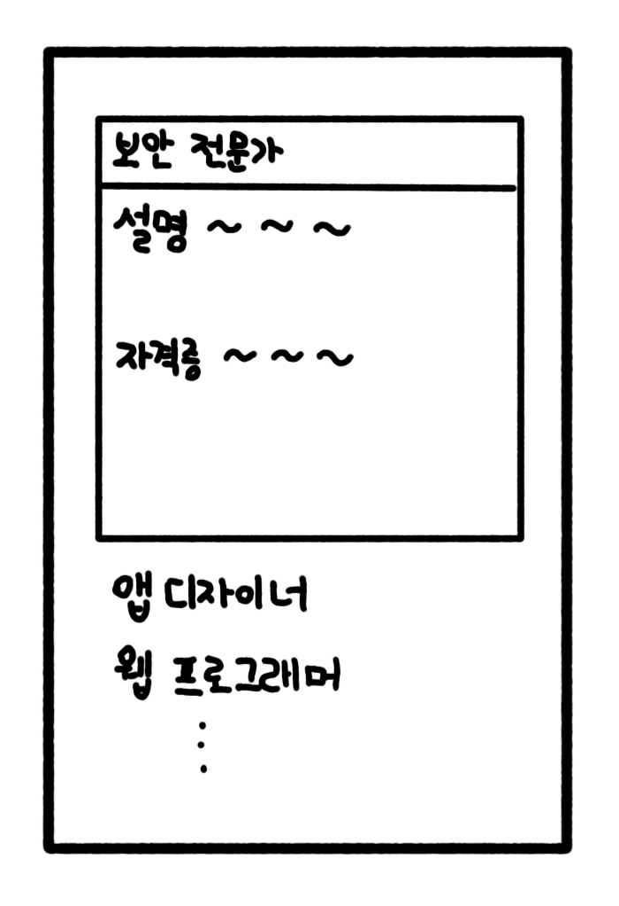
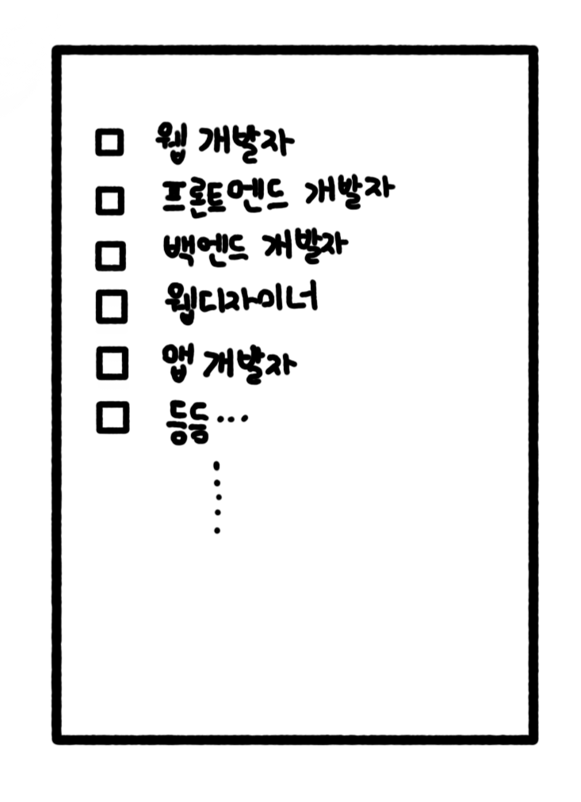
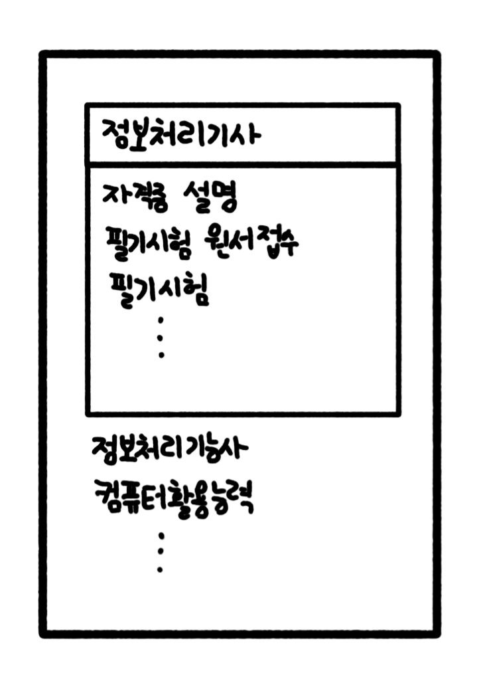
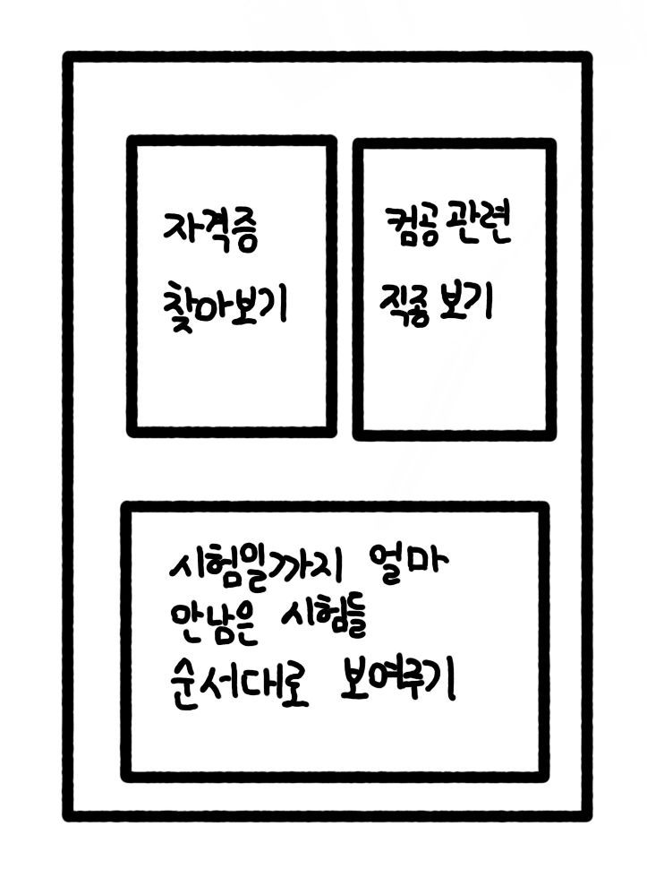

# **22.06.27(일)**

 

**목차**

**1. 어플 설명**

**2. 지금까지의 진행상황**

**3. 어플 구상도**

**4. 앞으로의 진행 계획**

 

## **1. 어플 설명**

전공(컴퓨터)과 관련된 자격증과 직업에 대한 정보를 제공하는 어플리케이션. 이를 통해 취업준비나 무엇부터 시작하면 좋을지 잘 모르는 사람들에게 도움을 주고자 함

 

## **2. 지금까지의 진행상황**

 

## **3. 어플 구상도**

 

## **4. 앞으로의 진행 계획**

- 안드로이드 스튜디오를 통해 어플 개발
- 자료를 관리하는데 있어 데이터베이스를 활용할 수 있는지 조사하기
- 어플 외형을 꾸미기 위한 자료 수집

 
