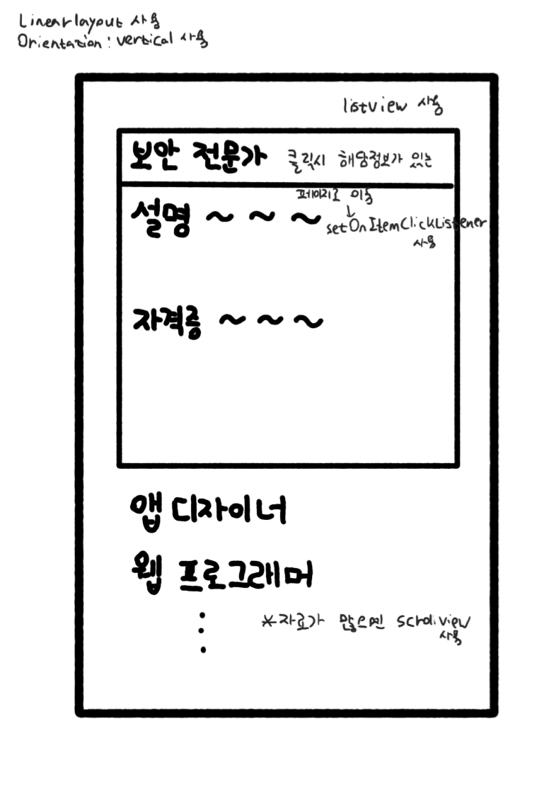

# **22.07.20(수)**

 

**목차**

**1. 어플 구상도**

**2. 지금까지의 진행상황**

**3. 앞으로의 진행 계획**

 

## **1. 어플 구상도**

**처음 어플에 들어가면 보이는 화면**

**어플 디자인 형태**

**'자격증 찾아보기' 클릭시 나오는 화면**

**'컴공관련 직종 보기' 클릭시 나오는 화면**

 

 

## **1. 지금까지의 진행상황**

- 어플의 기본적인 형태 결정
- 어플 개발에 사용할 안드로이드 스튜디오 학습
- 안드로이드 개발을 위한 JAVA 학습
- 어플에 들어갈 자료들에 대한 조사(ex. 자격증, 직업)
 

## **4. 앞으로의 진행 계획**

- 

 
