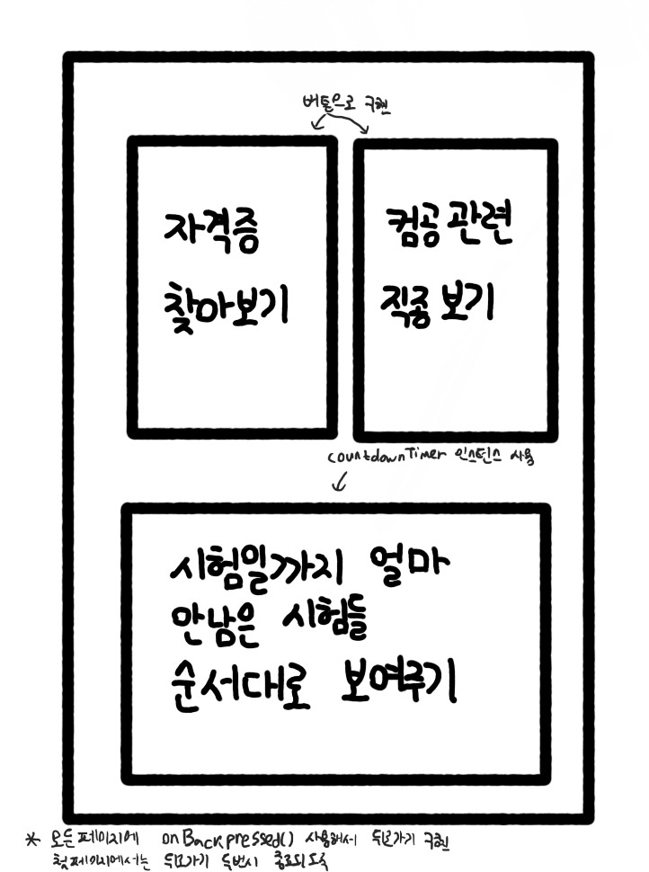
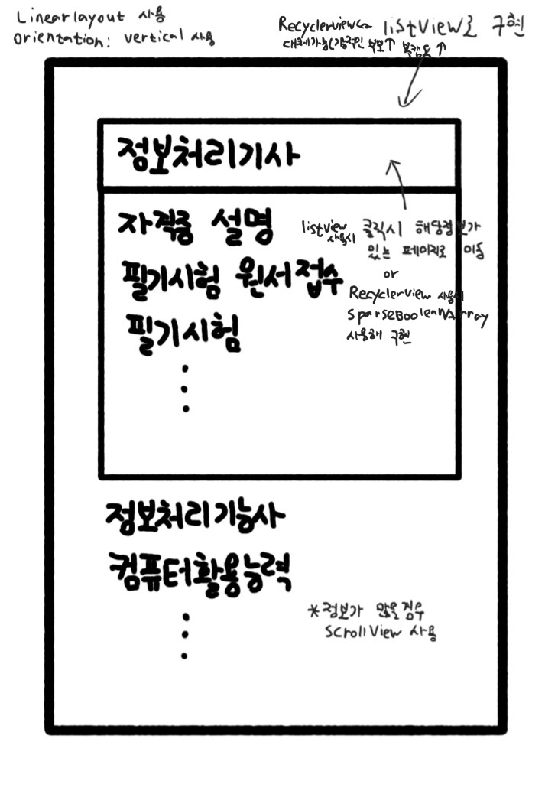

# **22.07.20(수)**

 

**목차**

**1. 지금까지의 진행상황**

**2. 앞으로의 진행 계획**

 

## **1. 어플 설명**

전공(컴퓨터)과 관련된 자격증과 직업에 대한 정보를 제공하는 어플리케이션. 이 어플을 통해 자격증 공부나 무엇부터 시작하면 좋을지 잘 모르는 사람들에게 직업과 자격증에 대한 정보를 제공함으로서 도움을 주고자 함

 

## **2. 지금까지의 진행상황**

- 어플의 기본적인 형태 결정
- 어플 개발에 사용할 안드로이드 스튜디오 학습
- 안드로이드 개발을 위한 JAVA 학습
- 어플에 들어갈 자료들에 대한 조사(ex. 자격증, 직업)
 

## **3. 어플 구상도**

**처음 어플에 들어가면 보이는 화면**

**'자격증 찾아보기' 클릭시 나오는 화면**

**직업 선택후 나오는 추천 자격증 화면**

**'직종 추천' 클릭시 나오는 화면**

 

## **4. 앞으로의 진행 계획**

- 안드로이드 스튜디오를 통해 어플 개발
- 자료를 관리하는데 있어 데이터베이스를 활용할 수 있는지 조사하기
- 어플 외형을 꾸미기 위한 자료 수집
- 추가적인 기능에 대해 생각해보기
- 시간적 여유가 된다면 다른 분야의 정보까지 넣기

 
